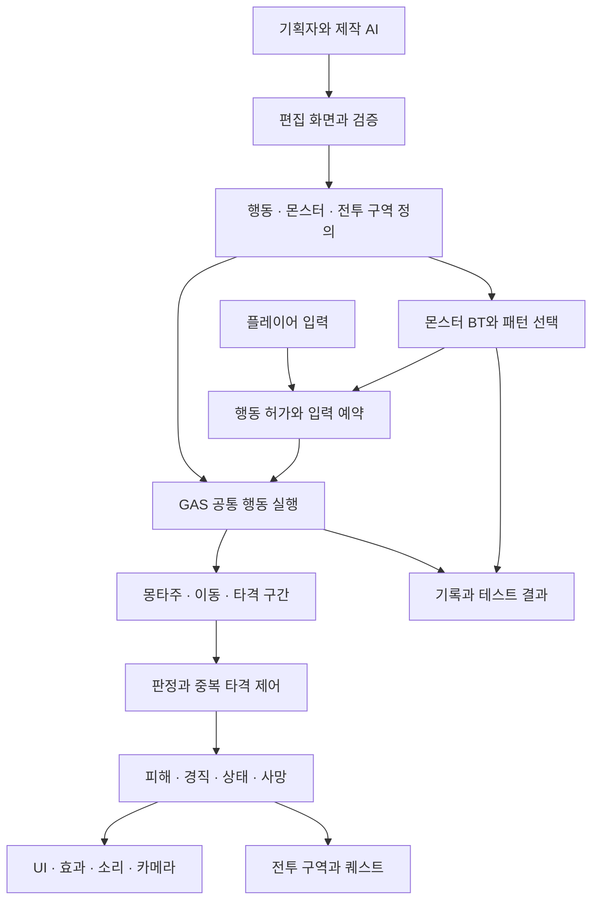

# Project Constellation 전투와 몬스터 AI 개편 기획서

작성일: 2026년 10월 4일
상태: 조사 기반 방향 제안과 검토용 초안
독자: 전투 기획을 처음 시작하며 AI와 함께 개발하는 1인 기획자

## 1 결론과 목표

**소울라이크의 관찰·회피·반격을 기본으로 하고, 스킬과 궁극기에서 액션 RPG의 역동성과 보상을 제공한다. 이를 반복 제작할 수 있도록 공통 전투 기반, 몬스터 행동 템플릿, 기획자용 편집 도구를 함께 구축한다.** 품질은 새 기술을 도입했다는 사실보다 입력 응답, 애니메이션과 판정의 일치, 적의 공정성, 수정과 재시험의 속도로 평가한다.

사용자가 확정한 방향은 기존 전투 전반의 개편, AI를 활용한 기획자 단독 제작, 소울라이크 중심 구조, 액션 RPG 느낌의 스킬·궁극기다. 아래 제안은 이를 구체화한 것이며 특정 게임의 수치나 전투를 복제하는 계획은 아니다.

권장 기술 방향은 **GAS 기반 공통 행동 실행 + Behavior Tree 기반 몬스터 판단 + 데이터 에셋 중심 제작 + 기획자용 편집 화면**이다. 먼저 작은 시험 전투 하나에서 목표 감각과 제작 흐름을 검증하고, 기존 콘텐츠는 구역 단위로 옮긴다.

‘혼자 모든 전투를 만든다’에는 두 종류의 작업이 있다. 이미 마련된 공격·투사체·범위기·상태 효과를 조합하는 일은 기획자가 도구에서 수행한다. 완전히 새로운 규칙이나 특수 이동은 AI가 개발 파트너로 코드와 검증을 보강한다. 자연어 한 번으로 검수 없이 완성된 전투가 생성되는 것을 성공 기준으로 삼지 않는다.

## 2 조사 범위와 확인 수준

현재 프로젝트의 C++ 소스, 설정, 플러그인, 전투 에셋 목록, 기존 문서와 10월 1일 블루프린트 그래프 감사 자료를 확인했다. Epic 공식 문서의 UE 5.8 페이지를 조사했다. Constellation.uproject의 EngineAssociation은 5.8이며 로컬 UE_5.8 설치 폴더도 확인했다. 정확한 엔진 빌드와 신규 API 호환성은 구현 착수 시 검증한다.

본 문서는 **현재 파일 직접 확인**, **기존 감사 기록**, **설계상 위험 추론**, **신규 제안**을 구분한다. 이번에 에디터에서 전체 그래프를 다시 추출하거나 실제 전투를 플레이하지 않았다. 따라서 체감 품질의 원인을 확정하거나 확인하지 못한 기능의 부재를 단정하지 않는다.

10월 1일 그래프는 당시 구조의 근거다. 특히 BP_Player_Heroine은 이후 수정되어 최신 그래프와 같다고 볼 수 없다. BTT_Attack, BTT_GetNextPatrolPoint, BTS_CheckDistance의 현재 SHA-256은 당시 최종 수정 기록과 일치한다. 다른 에셋은 파일 존재와 수정 시각만으로 그래프 동일성을 입증하지 않았다.

이번 산출물은 조사·기획 문서다. 게임 코드·전투 에셋 변경, 전투의 현재 플레이 검증, 신규 시스템 구현은 수행하지 않았다. 기존 작업 중 변경분은 유지한다.

## 3 전투를 구성하는 기본 개념

공격 버튼에 애니메이션 하나를 연결하는 것만으로 전투가 완성되지는 않는다. 다음 여섯 가지가 같은 규칙과 시간에 맞아야 한다.

| 구성 | 쉬운 설명 | 기획자가 결정할 내용 |
| --- | --- | --- |
| 입력과 행동 허가 | 지금 공격할 수 있는가 | 입력 예약, 자원 부족, 회피로 취소 가능한 순간 |
| 동작과 이동 | 어떤 자세로 어디까지 움직이는가 | 준비·베기·회수, 전진 거리, 회전 허용량 |
| 명중 판정 | 언제 어디에 닿으면 맞는가 | 검 궤적, 판정 구간, 벽 차단, 타격 횟수 |
| 피해와 상태 | 맞았을 때 무엇이 변하는가 | 체력, 경직, 자세 붕괴, 무적, 사망 |
| 피드백 | 결과를 어떻게 느끼게 하는가 | 소리, 섬광, 짧은 정지, 카메라, 피격 반응 |
| 적의 판단과 전투 구성 | 적이 언제 무엇을 하는가 | 감지, 접근, 패턴, 동시 공격 수, 승리 조건 |

**선딜**은 타격 전 준비 시간, **유효 구간**은 피해를 줄 수 있는 시간, **후딜**은 공격 후 회수 시간이다. 적의 **전조**는 공격을 예고하는 자세·소리·표시다. **입력 버퍼**는 다음 동작을 위해 입력을 잠깐 기억하는 기능, **캔슬 창**은 다른 행동으로 전환을 허용하는 구간이다. 둘을 구분해야 반응성과 무한 연타 문제를 함께 다룰 수 있다.

**경직**은 잠시 행동을 멈추는 반응, **슈퍼아머**는 피해를 받더라도 일부 경직을 견디는 규칙, **무적**은 지정한 피해를 받지 않는 규칙이다. **자세 또는 강인도**는 체력과 별개로 무너뜨릴 수 있는 자원이다. 스킬을 화려하게 만든다고 이 규칙을 모두 해제하면 기본 전투의 긴장감이 사라진다.

## 4 언리얼 제작 방식과 기획자 도구

언리얼은 완성된 소울라이크 제작기를 기본 제공하는 것이 아니라, 조합해서 전투와 제작 도구를 만드는 기능을 제공한다. 아래 역할 분담은 이 프로젝트의 1인 제작 목표에 맞춘 제안이다.

| 도구 | 제공 기능 | 기획자의 사용 방식 |
| --- | --- | --- |
| Blueprint와 C++ | 시각적 로직 편집과 코드 확장 | AI와 공통 기반을 개발하고 평소에는 공개 속성과 템플릿 편집 |
| GAS | 능력·수치·효과를 다루는 프레임워크 | 공격·회피·스킬·궁극기의 비용, 조건, 쿨다운과 효과 설정 |
| Animation Montage | 동작 재생과 구간 연결 | 공격별 동작과 콤보 연결 편집 |
| Animation Notify와 Notify State | 동작의 순간·구간에 이벤트 연결 | 타격·무적·캔슬·소리 구간을 동작에 맞춰 표시 |
| Motion Warping | 루트 모션을 목표 위치·방향에 맞게 조정 | 짧은 돌진과 마무리 동작의 이동 보정 |
| Behavior Tree와 Blackboard | 조건에 따른 행동 선택과 판단 정보 저장 | 공통 트리에 몬스터별 패턴 목록 연결 |
| StateTree | 계층 상태와 조건에 따른 전환 | BT의 대안으로 검토 |
| AI Perception | 시각·청각 등의 감지 결과 제공 | 적 발견·놓침·조사 설정 |
| NavMesh와 EQS | 이동 공간과 후보 위치 평가 | 길찾기, 이후 측면 이동·자리 선정 확장 |
| Data Asset와 Data Table | 구조화된 설정과 표 기반 데이터 | 공격·몬스터 정의와 다수 수치 편집 |
| Editor Utility Widget | 에디터용 사용자 정의 도구 화면 | 생성·복제·검증·시험장 실행 화면 |
| Data Validation | 사용자 정의 에셋 검사 | 누락 모션·잘못된 구간·잘못된 참조 확인 |
| Visual Logger | 실행 상태와 공간 정보 기록 | 적이 공격하지 않은 이유와 선택 위치 추적 |
| Python 에디터 자동화 | 에디터 에셋 작업 자동화 | AI 데이터 가져오기와 검증·리포트 생성 |

GAS는 능력, Attribute, Gameplay Effect, 비동기 Ability Task 등의 기반을 제공한다. 그러나 검 판정, 좋은 콤보, 공정한 AI, 기획자 친화적인 화면은 프로젝트가 설계해야 한다. [Epic GAS 문서](https://dev.epicgames.com/documentation/en-us/unreal-engine/gameplay-ability-system-for-unreal-engine)

Montage는 동작과 섹션을 관리하고, Notify는 동작에 맞춘 이벤트를 제공한다. Motion Warping은 루트 모션 보정 기능이다. 이를 도입하는 것과 실제 캐릭터의 접지·타격 위치가 좋아지는 것은 별도로 검증해야 한다. [Montage](https://dev.epicgames.com/documentation/en-us/unreal-engine/animation-montage-in-unreal-engine), [Notify](https://dev.epicgames.com/documentation/en-us/unreal-engine/animation-notifies-in-unreal-engine), [Motion Warping](https://dev.epicgames.com/documentation/en-us/unreal-engine/motion-warping-in-unreal-engine)

BT와 Blackboard는 행동 선택과 판단 정보를 나누며, StateTree는 계층 상태·전환을 구성한다. Perception은 감지를, EQS는 환경에서 유용한 후보를 찾는 역할을 맡는다. 본 기획은 기존 BT를 활용하고 EQS는 전술적 위치 선정이 필요할 때 추가한다. [BT](https://dev.epicgames.com/documentation/en-us/unreal-engine/behavior-tree-in-unreal-engine---overview), [StateTree](https://dev.epicgames.com/documentation/en-us/unreal-engine/overview-of-state-tree-in-unreal-engine), [Perception](https://dev.epicgames.com/documentation/en-us/unreal-engine/ai-perception-in-unreal-engine), [EQS](https://dev.epicgames.com/documentation/en-us/unreal-engine/environment-query-system-in-unreal-engine)

기획자의 일상 도구는 전투 정의 화면, 몽타주 에디터, 레벨 뷰포트, PIE와 로그로 좁힌다. PIE는 에디터 안에서 게임을 실행하는 기능이다. Blender·Control Rig·리타기터·Niagara는 각각 동작 제작·보정·이식·시각 효과가 필요한 단계에서 사용한다. 매번 모든 도구를 직접 다루게 하지 않는 것이 전용 편집 화면의 목적이다.

## 5 현재 프로젝트와 목표 비교

아래 에셋은 /Game/Constellation/ 기준이다. ‘기존 그래프’는 10월 1일 추출 자료다.

| 영역 | 확인한 구현 | 차이와 조치 |
| --- | --- | --- |
| 기본 공격 | Gameplay/Combat/Components/Ac_Attack에 Hitbox 켜기·끄기, HitTargets, Check Unique Target, Reset State 존재 | 중복 타격 방지는 이미 있음. 공격별 정의·실행 ID·취소 정리를 플레이어와 적이 공유하도록 개편 |
| 콤보 | Ac_ComboAttack에 CurrentComboState, 입력 저장 변수, 배율 배열, 3개 Do Attack 호출, 쿨다운 Delay 존재 | 고정 분기를 데이터로 옮겨 타수와 순서를 바꿀 때 그래프 수정 부담 축소 |
| 회피 | Ac_Dodge의 실행·종료·쿨다운과 기존 플레이어의 DodgeTimeline 확인 | 10월 1일 감사에서 회피 곡선 누락이 보류됨. 최신본 확인 후 거리·무적·회수·비용을 설계 |
| 수치 | Ac_Stats에 HP·Stamina, 피해 계산·복구·사망 등의 이벤트 존재 | 수치 개념 재사용. 이관 시 HP 원본을 하나로 유지하고 기존 UI에 호환 경로 제공 |
| 피해 전달 | 플레이어 공격의 BPI_Damageable.TakeDamage, 적 그래프의 ApplyDamage와 TakeDamage 관련 경로 | 전달 방식이 섞여 있음. 실제 중복 여부는 미검증. 공통 피해 처리 진입점으로 통일 |
| 몬스터 동작 | BP_Monster에 공격 몽타주, 돌진, 피격·넉백·사망·HP UI | 외형과 공통 전투 실행을 분리하고 종료·중단 시 정리 규칙 통합 |
| 몬스터 AI | AIC Base/Patrol/Stationary/Event, BB_Monster, BT Base/Patrol/Stationary, 감지·거리 검사 존재 | BT 기반은 활용. 패턴 조건·전조·회수·복귀·다수전 제어를 공통화 |
| 공격 태스크 | 기존 BTT_Attack 성공 경로는 Do Attack → AttackDelay → FinishExecute. 캐스트 실패 종료는 이후 수정 | 고정 대기는 동작 길이·배속·취소와 불일치할 위험. 실제 행동 종료 결과를 대기 |
| 전투 구역 | BP_BattleManager, BP_BattleZone 계열, MonstersToWatch와 타이머 기반 HP 확인 | 구역·문·퀘스트 의미 유지. 적 등록·사망 이벤트와 웨이브·리셋 규칙으로 정리 |
| 퀘스트 | AC_QuestProgressOnBattleEnd가 BattleZoneKey와 종료 이벤트로 진행 연결 | 새 전투 구역에서도 기존 키·이벤트 연결. 중복 보상·진행 방지 |
| 입력 연동 | 현재 C++ CarryInputLibrary가 들기 상태의 IA_Attack을 조준·던지기로 소비하며 BP 상태도 읽음 | 전투 입력 개편 시 들기·던지기·등반·밀기와 우선순위 명시 |
| 피격 연동 | 현재 CarryComponent는 OnTakeAnyDamage에서 들기 취소 | GAS 수치 변경이 이 이벤트를 자동 발생시킨다고 가정하지 말고 명시적 피해 알림 연결 |
| 연출 | SceneDirector 플러그인 Runtime/Editor 모듈과 제작 문서 존재 | 등장·종료 연출에 활용. 명중·피해의 기준은 전투 실행 계층이 소유 |
| GAS 기반 | 현재 런타임 Build.cs에 GameplayAbilities/GameplayTags/GameplayTasks 의존성 없음 | 현재 네이티브 기반이 GAS라는 근거는 없음. 채택은 새 기반 개발과 이관 작업 |

개선 대상은 블루프린트 사용 자체가 아니다. 공격 상태·피해·입력·AI 종료가 여러 곳에 나뉘면 새 스킬마다 연결을 다시 맞추는 비용이 발생한다. 이것이 단독 제작 목표의 주요 구조적 장애라는 판단이다. 실제 체감 문제의 원인은 플레이 영상과 로그로 좁혀야 한다.

기존 실패 처리 수정은 재사용한다. BTT_Attack 캐스트 실패, 순찰 인덱스 복구, 거리 검사 실패값 초기화를 새 미해결 버그처럼 반복 수정하지 않는다.

## 6 목표 전투 감각

### 기본 교전

플레이어는 거리를 잡고 전조를 읽은 뒤 회피나 이동으로 대응하며 적의 회수 구간에 반격한다. 일반 공격과 회피에는 자원 또는 행동상의 대가가 있어야 한다. 첫 범위는 체력·스태미나, 3타 일반 공격, 회피, 타깃 잠금·해제, 피격·사망으로 제안한다. 가드·패링은 후속 선택 기능이며 소울라이크라는 이유만으로 모두 추가하지 않는다.

입력은 즉시 수락하거나 예약하거나 거절 이유를 기록한다. 전조를 보고 회피를 눌렀는데 실행되지 않았다면 입력 손실과 취소 불가 구간을 구분할 수 있어야 한다.

### 스킬과 궁극기

스킬은 기본 교전에서 만든 틈을 크게 활용하는 수단이다. 첫 스킬은 짧은 돌진 베기, 첫 궁극기는 광역 베기를 제안한다. 스킬은 거리 좁히기와 자세 피해를, 궁극기는 축적한 기회의 큰 보상을 담당한다. 벽 통과·무제한 추적·전체 구간 무적은 기본값으로 허용하지 않는다.

스킬은 쿨다운, 궁극기는 명중과 성공적인 대응으로 채우는 게이지를 초기 가설로 둔다. 별도 마나까지 즉시 추가하지 않는다. 다단 히트의 게이지 충전 상한, 궁극기의 자기 게이지 재충전 금지, 보스 경직 저항을 명시한다. 궁극기 연출의 시간 감속, 플레이어 보호, 적 공격 진행 여부는 각각 정한다.

### 적의 공정성과 화면 가독성

적은 준비 중 제한적으로 방향을 조정하고 타격 직전부터 회전·추적을 제한한다. 회피 성공 뒤 즉시 180도 돌아 맞히는 행동은 기본값으로 금지한다. 전조와 판정은 실제 게임 카메라에서 확인한다. 화려한 효과가 다른 적의 전조를 가리면 효과 밀도·투명도·카메라를 조정한다.

다수전은 근접 공격 허가 슬롯으로 동시 압박을 제어한다. 초기 시험값은 적극적으로 공격하는 적 1~2마리, 나머지는 접근·측면 이동·거리 유지다. 최종 난이도 값은 아니며 원거리 발사 압박은 별도로 관리한다.

## 7 기술 선택지와 권장안

| 선택지 | 장점 | 비용과 위험 | 판단 |
| --- | --- | --- | --- |
| 기존 BP와 경량 컴포넌트 정리 | 초기 결과와 기존 연결 유지가 빠름 | 스킬·효과 증가 시 비용·상태·중첩·취소 체계를 직접 개발 | 전투 종류와 확장 계획이 작다면 유효 |
| GAS 공통 실행과 BT, 데이터 편집 도구 | 능력·수치·효과 공통화와 반복 제작에 유리 | 초기 C++ 기반·에디터 지원·기존 콘텐츠 이관 비용 | **권장** |
| 외부 전투 프레임워크 또는 대형 샘플 전면 도입 | 기존 기능으로 빠른 시연 가능 | 들기·등반·퀘스트·캐릭터 충돌, 버전·지원·라이선스 검토 | 현재 단계에서 구매·도입 권장하지 않음 |

GAS 선택은 스킬·궁극기·상태 효과를 계속 확장할 목표에 따른 추천이다. 도입 자체가 전투 퀄리티를 보장하지 않는다. 공격 하나를 실행·취소하고 UI·들기·AI 종료까지 연결하는 작은 시제품에서 적합성을 판단한다. 복잡성이 과도하면 콘텐츠 양산 전에 경량안으로 재결정한다.

몬스터 AI는 기존 자산을 활용할 수 있는 BT를 유지한다. StateTree는 상태 중심 흐름에 유효한 대안이지만 초기에는 함께 운영하지 않는다. BT는 무엇을 할지 정하고 GAS는 지시받은 행동을 실행한다. 두 시스템이 동시에 다른 공격을 명령하지 않도록 경계를 둔다.

Lyra는 모듈화와 GAS를 공부할 공식 예제로 활용한다. 온라인 슈팅 중심 구조 전체를 근접 전투 프로젝트에 그대로 이식하는 것은 권하지 않는다. [Epic Lyra 문서](https://dev.epicgames.com/documentation/en-us/unreal-engine/lyra-sample-game-in-unreal-engine)

## 8 공통 실행 구조와 규칙

전투 Runtime과 제작용 Editor 모듈을 분리한다. 패키징된 게임은 편집 화면이나 Python 없이 동작한다. 초기 UI는 Details 패널과 Editor Utility Widget을 활용하고, 반복 작업에서 부족함이 확인된 부분만 C++ 전용 에셋 편집기로 확장한다. [Editor Utility Widgets](https://dev.epicgames.com/documentation/en-us/unreal-engine/editor-utility-widgets-in-unreal-engine), [에디터 Python](https://dev.epicgames.com/documentation/en-us/unreal-engine/scripting-the-unreal-editor-using-python)

| 책임 | 소유할 정보 | 경계 |
| --- | --- | --- |
| 행동 실행 | 현재 능력·실행 ID·비용·쿨다운·종료 결과 | BT와 애니메이션이 각자 HP를 바꾸지 않음 |
| 수치와 상태 | HP·스태미나·궁극기 자원·상태 태그 | 원본은 하나, 기존 BP 변수는 호환용 파생값 |
| 타격 판정 | 활성 구간·궤적·이미 맞은 대상 | 공통 피해 처리에 결과 전달 |
| AI 판단 | 목표·후보 패턴·선택 이유 | 고정 시간으로 행동 종료를 추측하지 않음 |
| 전투 구역 | 등록 적·웨이브·시작·종료·실패·리셋 | 문·퀘스트에는 결과 이벤트 전달 |
| 연출 | 시각·음향·카메라 | 임의 Delay로 명중이나 무적을 확정하지 않음 |

공통 종료 결과는 성공·취소·실패를 구분한다. 사망·피격 중단·몽타주 교체·대상 소멸·맵 전환에서 타격 창, 임시 태그, 이동 제약, 카메라 소유권을 정리한다. BT 태스크도 정상 종료뿐 아니라 실패와 Abort를 처리한다.

우선순위는 사망을 최상위로 두고, 연출 제어·강제 상태·일반 행동의 허가 규칙을 명시한다. 피해와 경직은 분리한다. 슈퍼아머 때문에 동작이 유지되어도 피해는 적용될 수 있다. 효과 종료 시 다른 시스템의 무적이나 입력 잠금까지 해제하지 않도록 적용 주체를 추적한다.

## 9 기획자가 작성할 데이터와 예시

가칭 CombatActionDefinition, MonsterDefinition, EncounterDefinition 세 종류로 시작한다. 현재 존재하는 클래스 이름이 아니라 신규 제안이다.

| 데이터 | 기본 항목 | 고급 항목 |
| --- | --- | --- |
| 행동 정의 | 이름·동작·피해·비용·쿨다운·타격 구간·후속 행동 | 취소 조건·회전 제한·다단 히트·이동 보정·슈퍼아머 |
| 몬스터 정의 | 외형·HP·속도·감지 거리·공격 목록·성향 | 거리 조건·가중치·반복 제한·체력 단계·복귀 |
| 전투 구역 정의 | 위치·적 구성·시작·승리 조건·문·퀘스트 | 웨이브·재도전·이탈·동시 공격 수·복구 |

Data Asset은 참조와 구조화된 설정에, Data Table은 다수 수치의 일괄 비교에 사용한다. 동일 값을 양쪽에서 독립 편집하지 않고 원본과 파생값을 표시한다. [Data Assets](https://dev.epicgames.com/documentation/en-us/unreal-engine/data-assets-in-unreal-engine), [Data Driven Gameplay](https://dev.epicgames.com/documentation/en-us/unreal-engine/data-driven-gameplay-elements-in-unreal-engine)

**타이밍의 원본은 몽타주의 이름 있는 Notify State 구간으로 정하는 안을 권장한다.** 전용 화면은 같은 구간을 읽고 수정한다. 별도 JSON 시간표와 몽타주를 동시에 원본으로 두지 않는다. 모션 교체·배속 변경 시 타격·취소 창을 재검사하고, 타이밍이 다른 변형은 전용 몽타주를 명시적으로 생성한다.

타격은 ‘공격 실행 ID + 타격 구간 ID + 대상’으로 중복을 제한한다. 다단 히트는 구간 분리 또는 최소 재타격 간격을 명시한다. 빠른 검 궤적은 이전·현재 소켓 위치 사이를 sweep하는 방식을 우선 검토하며 긴 프레임·회전의 누락은 추가 샘플로 검증한다. 벽·아군·사망 대상·파괴물 필터도 공통 규칙으로 정의한다. 이는 신규 구현 제안이다.

다음 값은 **첫 실험용 예시**이며 출시 밸런스나 기존 게임 수치가 아니다.

| 행동 | 의도 | 첫 시험 설정 |
| --- | --- | --- |
| 일반 베기 1타 | 읽기 쉬운 근접 공격 | 유지 중인 Attack01의 1.0초 클립, 0.35~0.50초 타격, 0.50~0.65초 콤보 창을 출발점으로 게임 연결 검증 |
| 회피 | 적 타격 구간에서 벗어남 | 0.6초 동작, 시작 후 0.10~0.30초 무적, 스태미나 20을 실험. 거리는 모션·벽·낙하와 함께 결정 |
| 돌진 스킬 | 반격 기회 확장 | 쿨다운 8초, 보정 거리 최대 300cm, 자세 피해 강화. 벽·대상 소멸에서도 정상 종료 |
| 광역 궁극기 | 축적한 기회의 보상 | 게이지 100, 임시 범위 350cm, 보호 구간 명시. 다단 횟수와 자기 게이지 충전 금지 |

Attack01 자료는 게임 내 검증 완료를 뜻하지 않는다. 유지 중인 워크플로에는 2타 연결이 미검증으로 기록되어 있다. 새 캐릭터용 2·3타, 회피, 스킬, 궁극기, 피격과 몬스터 전조 모션을 별도 작업량으로 계산한다. 기존 기본 캐릭터용 3타 에셋이 있는 것과 새 캐릭터의 연결 품질이 확보된 것을 구분한다.

캐릭터의 스타일과 160cm 기준을 보존하고 접지·템포·의상 검사는 기존 AnimationWorkflow를 따른다. Attack01 README의 과거 /Game/Resources/ 경로는 현재 Characters/Heroine/Refined/Animations 자산과 이동 기록을 확인해 연결한다.

## 10 몬스터 AI 제작 방식

기획자가 몬스터마다 그래프를 새로 그리기보다 공통 트리를 선택하고 패턴 표를 작성한다. 기본 흐름은 관찰 → 접근 → 거리 확보 → 공격 선택 → 실제 종료 대기 → 재판단이다. 피격·사망·복귀는 우선순위를 가진 중단 경로다.

Blackboard에는 목표, 거리·시야, 마지막 확인 위치와 시각, 고향 위치, 공격 가능 상태를 둔다. 감지는 이벤트로 받고 거리·전술 판단은 필요한 주기로 갱신한다. 모든 적이 매 프레임 복잡한 위치 탐색을 하지 않도록 하되 최종 주기는 측정해 정한다.

첫 근접 몬스터는 세 패턴으로 제안한다. 외형은 기존 자산을 후보로 삼되 동작 준비 상태를 먼저 확인한다.

| 패턴 | 조건 | 읽을 정보 | 회수와 실패 |
| --- | --- | --- | --- |
| 전방 타격 | 가까운 전방, 쿨다운 종료 | 짧지만 구분되는 준비 자세 | 빗나가도 회수 유지 |
| 전진 돌진 | 중거리, 경로 확보 | 몸을 낮추는 긴 준비 | 출발 직전 방향 고정, 벽에 닿으면 중단·회수 |
| 지연 강타 | 근거리, 연속 사용 제한 | 준비 후 멈칫하는 독립된 전조 | 큰 후딜로 반격 보상 |

거리·각도·시야·자원·쿨다운·공격 허가로 후보를 먼저 거르고 남은 후보에 가중치를 적용한다. 직전 패턴 반복 제한을 두며 후보가 없으면 위치 조정 또는 관찰로 돌아간다. 로그에는 ‘돌진 제외: 벽’, ‘강타 제외: 쿨다운’, ‘전방 타격 선택: 조건 충족’처럼 이유를 남긴다.

대상을 놓치면 마지막 위치를 확인하고 지정 시간 내 재탐색한다. 너무 멀면 복귀하며 길찾기 실패는 제한된 재시도와 대체 행동으로 처리한다. 복귀 중 HP 회복·무적 여부, 플레이어 사망, 재진입 초기화는 전투 구역 규칙으로 정한다. 기본안은 완전 복귀 시 초기 상태 복원이며 초기화만으로 보상을 재지급하지 않는다.

보스는 이후 같은 패턴 체계에 체력 단계를 얹는다. 단계 전환 중복, 공격 도중 단계 전환, 사망과 전환의 우선순위를 정의한다. 초기부터 보스 전용 그래프 언어를 별도로 만들지 않는다.

## 11 기획자용 편집 화면과 AI 협업

가칭 Constellation Combat Editor는 자주 하는 작업을 한 화면에서 끝내는 도구다.

| 영역 | 기능 |
| --- | --- |
| 왼쪽 | 공격·몬스터·전투 구역 검색, 템플릿 생성·복제 |
| 중앙 | 모션·검 궤적·타격 범위와 전조·회수 구간 |
| 오른쪽 | 필수 값 우선 표시, 단위와 설명, 고급 설정 접기 |
| 하단 | 누락 참조·시간 오류·선택 불가 패턴·실행 로그 |
| 상단 | 검증, 시험장 배치, PIE, 기준 버전 비교, 저장 |

초기에는 기존 몽타주 에디터와 레벨 뷰포트를 열어 주는 통합 화면으로 충분하다. Undo/Redo, 복제, 참조 검사와 오류 위치 이동을 지원한다. 실행 중 현재 행동 ID, 자원·쿨다운, 타격 창, 취소 가능 행동, AI 선택 이유를 보여 준다.

첫 제작 흐름은 ‘근접형 복제 → 외형·모션 선택 → 세 패턴의 거리·전조·피해 입력 → 시험장 배치 → 느린 재생과 정상 속도 교전 → 검증·저장’이다. 같은 유형의 두 번째 몬스터를 만드는 동안 C++나 BP 그래프를 열 필요가 없어야 한다.

여기서 **제작 AI**는 문서·데이터·코드 작업을 돕는 AI이며, **몬스터 AI**는 게임에서 행동을 선택하는 규칙이다. 초기 몬스터 판단에는 언어 모델 호출이 필요하지 않다.

| 기획자 | 제작 AI | 자동 확인 |
| --- | --- | --- |
| 역할·감각 설명 | 템플릿에 맞춰 변경 제안 | 필드·ID·참조 유효성 |
| 전조·판정·보상 검토 | 데이터 작성·모션 후보 제안 | 시간 순서·비용·태그 |
| 직접 플레이하고 문제 설명 | 로그·재현 조건 분석 | 중복 피해·종료 누락·상태 잔류 |
| 결과 채택 | 가져오기·변경 기록 | 저장·재로드·패키지 참조 |

예시 요청: “근접 기본형을 복제해 겁이 많지만 빈틈을 보면 돌진하는 적을 만들어 줘. 연속 돌진은 하지 않고 빗나가면 반격 기회가 보여야 해. 기존 모션으로 가능한 범위와 부족한 모션을 먼저 구분해 줘.”

AI는 이를 접근 빈도·패턴 조건·쿨다운·회수·추적 제한으로 바꿔 제안한다. ‘공격성 20% 증가’처럼 검증하기 어려운 표현 대신 실제 변경 필드를 보여 준다.

가져오기 형식은 버전이 있는 구조화된 JSON 등으로 제한한다. 스키마 검사 → 참조·태그 확인 → 변경 차이 표시 → 에디터 API 적용 → 검증·저장 → 재로드 순서다. 동일 ID 재입력으로 중복 생성하지 않고, 잘못된 타입·경로·예상 밖 삭제를 거절한다. uasset을 텍스트처럼 직접 덮어쓰지 않는다. JSON은 가져오기 명세 또는 내보내기 결과이며 런타임 에셋과 다른 숨은 원본으로 두지 않는다.

채팅창 내장보다 데이터 입출력과 검사 리포트를 먼저 만든다. 사용하는 AI가 달라져도 제작물을 유지할 수 있어야 한다. 검증 규칙은 필수 모션, 스켈레톤 호환, 구간 범위, 종료 경로, 패턴 조건, soft reference 패키징 누락을 다룬다. [Data Validation](https://dev.epicgames.com/documentation/en-us/unreal-engine/data-validation-in-unreal-engine)

Visual Logger에 행동 ID·선택 이유·목표·판정 위치를 추가해 재현 자료를 만든다. 기본 도구 설치만으로 프로젝트 특화 기록이 자동 완성된다고 보지 않는다. [Visual Logger](https://dev.epicgames.com/documentation/en-us/unreal-engine/visual-logger-in-unreal-engine)

## 12 기존 시스템 이관과 제작 순서

전면 개편의 목표와 일괄 삭제는 다르다. 기존 콘텐츠를 비교 기준으로 남기고 시험용 캐릭터와 몬스터부터 새 경로를 적용한다.

1. 최신 BP·몽타주·기본값·맵 참조를 읽기 전용으로 재추출하고 기준 플레이 영상을 기록한다. 회피 곡선과 현재 캐릭터 연결을 재확인한다.
2. 별도 전투 시험장에서 플레이어·적 공격 각 1개, HP·피격·사망·취소를 새 실행 기반으로 연결한다.
3. BPI_Damageable과 새 피해 처리 사이에 단방향 호환 경로를 두고 한 액터의 HP·사망 판정은 하나만 소유한다. ApplyDamage와 새 효과가 같은 타격을 두 번 적용하지 않게 한다.
4. 회피·3타·잠금·스킬·궁극기를 추가한다. Carry 입력 소비, 등반·밀기·변신, 피해 시 들기 취소를 회귀 검증한다.
5. BT를 새 행동 요청·실제 종료 대기에 연결하고 패턴·복귀·다수전 제어를 검증한다.
6. BattleZoneKey·문·퀘스트를 새 전투 구역에 연결한다. 대상 파괴·구역 이탈·플레이어 사망·맵 전환도 처리한다.
7. 기획자가 두 번째 몬스터와 전투 구역을 만들고 반복 수작업을 도구에 반영한다.
8. 본편은 구역 단위로 적용한다. 참조·플레이 검증을 통과한 뒤 옛 구현을 은퇴시킨다.

HP·스태미나·행동 상태의 원본을 둘씩 유지하는 과도기를 길게 끌지 않는다. 호환 BP 불리언은 새 상태에서 읽기 전용으로 파생하고 제거 계획을 정한다. 전투·들기·연출이 서로의 입력 잠금을 무조건 해제하지 않게 소유권을 구분한다.

| 단계 | 산출물 | 완료 기준 |
| --- | --- | --- |
| 0 현황 재현 | 최신 그래프·기준 영상·문제 목록 | 보존·교체 대상, 회피·캐릭터 기준 확정 |
| 1 공통 코어 | 양측 공격 각 1개·피해·사망·취소·디버그 | 중복 피해·히트박스 잔류 없음, GAS 적용성 판단 |
| 2 기본 교전 | 3타·회피·잠금·스태미나·피격 | 예약·캔슬과 동작 일치, 1대1 반격 흐름 성립 |
| 3 특수 행동 | 돌진 스킬·광역 궁극기 | 교전 가독성·자원 의미 유지, 연출 후 제어 복구 |
| 4 몬스터와 구역 | 3패턴 적·복귀·3마리 조합·종료 연동 | 무한 대기·중첩 공격·중복 보상 없이 재도전 |
| 5 단독 제작 도구 | 생성·편집·검증·시험장·AI 입출력 | 두 번째 같은 유형 적과 구역을 그래프 수정 없이 제작 |
| 6 본편 이관 | 선택 구역과 패키지 빌드 | 퀘스트·문·들기·이동 회귀 통과, 사용자 체감 검토 |

날짜와 기간은 모션 수급·엔진 빌드·현재 플레이 문제 확인 뒤 산정한다. 큰 보스 여러 개, 다수 무기, 장비 랜덤 옵션, 복잡한 상성, 온라인 멀티플레이, 독자 노드 언어는 첫 범위에서 제외하는 안을 제안한다. 멀티플레이가 목표라면 서버 권한·예측·복제는 코어 개발 전에 설계해야 한다.

## 13 검증과 품질 수락 기준

컴파일, 데이터 검증, 플레이 감각, 성능은 서로 다른 확인이다. 다음은 **향후 시스템의 수락 기준**이며 이번에 통과한 결과가 아니다.

| 구분 | 시험 | 기준 제안 |
| --- | --- | --- |
| 판정 | 한 창에서 같은 적의 복수 콜리전에 접촉 | 단타 대상당 1회, 다단 지정 횟수·간격 준수 |
| 프레임 차이 | 30·60·120fps에서 공격 반복 | 지정 궤적의 누락·중복 없음, 창 경계 오차 기록 |
| 취소 | 선딜·유효·후딜 중 피격·사망·대상 제거·몽타주 중단 | 창·임시 무적·이동 제한·AI 대기 잔류 없음 |
| 자원 | 경계값·연타·실패한 스킬 시작 | 음수 자원·중복 비용·실패 시 쿨다운 오작동 없음 |
| 회피 | 창 직전·중·직후 피격, 벽·경사·낙하 | 정의한 무적·이동 규칙 준수 |
| AI | 길 막힘·시야 상실·플레이어 사망·공격 중단 | 이유를 기록하고 대체 행동·복귀 수행 |
| 다수전 | 근접 3마리, 이후 혼합 조합 | 동시 공격 제한 준수, 대기 적도 위치 행동 수행 |
| 연동 | 들기 중 공격·피격 낙하·연출 스킵·구역 재진입 | 입력 복구, 퀘스트·보상은 규칙상 1회 |
| 데이터 | 누락 모션·역전된 구간·없는 태그·스켈레톤 불일치 | 적용 전에 오류와 수정 위치 표시 |
| 패키징 | 에디터 종료 후 패키지 실행 | soft reference 포함, Editor·Python 의존 없음 |
| 제작성 | 같은 템플릿의 두 번째 적 제작 | 그래프·C++ 수정 0회, 필수 작업·오류 원인을 도구에서 확인 |

플레이에서는 전조를 보고 피할 수 있었는지, 맞은 이유가 보이는지, 반격 시간이 실제로 있는지, 입력이 예상대로 연결되는지, 스킬·궁극기가 화면을 가리지 않는지 확인한다. 정상 속도와 느린 재생을 모두 보고 접지·손과 무기·의상·회전 전환을 별도로 검사한다.

대표 PC의 60fps를 임시 목표로 두되 플랫폼 확정 전 고정 요구로 삼지 않는다. 1·3·10마리에서 AI·애니메이션·판정과 전체 프레임 시간을 분리 기록하고 본편 환경에서도 측정한다. 패턴 랜덤 시드를 고정하고 입력·조건·행동 ID를 기록한다. 물리까지 완전히 동일한 재현을 보장한다고 표현하지 않는다.

## 14 미확정 사항과 다음 작업

사용자 답변으로 전투 방향은 정해졌다. 미확정 사항은 싱글플레이 여부, 플랫폼·입력 장치, 잠금과 자유 조준의 비중, 가드·패링 포함 여부, 스킬 슬롯 수, 궁극기 보호 규칙이다. 초안은 **싱글플레이·PC·회피 중심·스킬 1개와 궁극기 1개 검증**을 임시 전제로 한다. 자세 시스템과 자원 수치는 첫 교전에서 조정한다.

권장 첫 실행 과제는 최신 현황 재현과 전투 시험장 범위 확정이다. 기존 공격·회피·몬스터 교전 영상을 기록하고 문제를 입력·판정·애니메이션·AI·카메라로 나눈다. 다음으로 GAS의 작은 수직 시제품을 만들어 기술 선택과 제작성을 검증한다. 그 결과를 토대로 단계 0~1의 구체적인 구현 명세와 작업 계획을 확정한다.

## 15 프로젝트 조사 근거

아래는 프로젝트 루트 기준 경로다. /Game/ 에셋은 로컬 Content/에 대응한다. Saved 감사 자료는 장기 보존이 보장되지 않아 핵심 구조와 한계를 본문에 요약했다.

- Constellation.uproject 및 Source/Constellation/Constellation.Build.cs: 엔진 연결과 의존성.
- Source/Constellation/MyCharacter.h, MyCharacter.cpp: 네이티브 캐릭터 기본 구현.
- Source/Constellation/CarryInputLibrary.cpp, CarryComponent.cpp, InteractionPromptComponent.cpp: 입력 소비·피해 반응·BP 상태 연동.
- Content/Constellation/Gameplay/Combat/: 공격·콤보·회피·스탯·인터페이스·매니저.
- Content/Constellation/Characters/Enemies/Blueprints/AI/: BT·Blackboard·Controller·Task·Service.
- Content/Constellation/Gameplay/Interaction/Actors/BP_BattleZone.uasset 및 GateAuto 계열.
- docs/project-logic-audit-2026-10-01.md: 적용한 수정과 회피 곡선 보류, 플레이 검증 한계.
- Saved/ProjectAudit/20261001/compact-graphs.json, applied-blueprint-repairs.json: 기존 연결과 최종 수정 해시.
- Plugins/ConstellationSceneDirector/ConstellationSceneDirector.uplugin 및 docs/2026-10-03-sequencer-designer-tool-plan.md.
- ArtSource/Heroine_Tripo_Review/AnimationWorkflow/SKILL.md 및 Attack01/README.md: 유지 원본·품질 기준·공격 알림·미검증 연결.

외부 링크는 2026년 10월 4일 확인한 Epic 공식 문서다. 공식 문서는 엔진 기능의 근거이고, 아키텍처 선택·예시 수치·우선순위는 본 프로젝트에 대한 제안이다.
